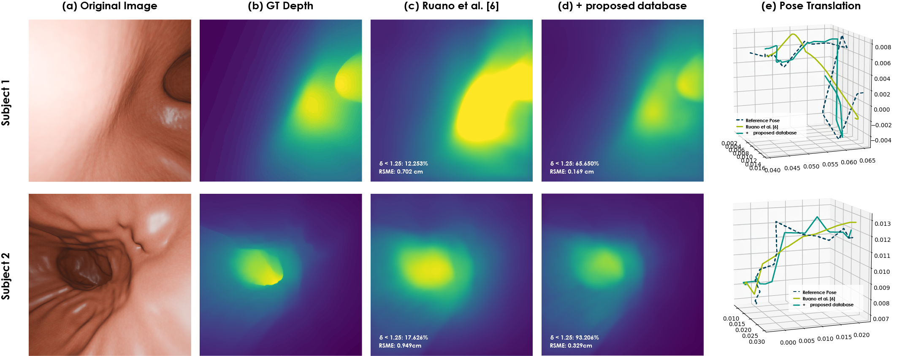

# A Realistic Synthetic Endoscopy Dataset from CT-Stomachs with Gastric Wall Textures learned from Endoscopy Images
A realistic synthetic endoscopy dataset from CT-derived 3D stomach models, with GAN-based gastric textures, depth maps, and 6-DoF poses.
This repository contains the **Synthetic Stomach Endoscopy Dataset**, a realistic virtual endoscopy collection generated from 3D stomach models reconstructed from abdominal CT scans. Gastric mucosa textures were synthesized using **Infinite Texture GANs** trained with real endoscopic mucosa patches.

## Authors
**Diana Y. Barrero†**, **Josué Ruano-Balseca†**, **Jean C. Polo†**, **Lina Muñoz‡**, **Cristian Gualdrón‡**, **Martín Gómez‡**, **Fabio González\***, **Eduardo Romero†**  
† *Computer Imaging and Medical Applications Laboratory (CIM@LAB)*  
‡ *Gastroenterology unit, Hospital Universitario Nacional, Bogotá, Colombia*  
\* *Machine Learning, Perception and Discovery Lab (MindLab), Universidad Nacional de Colombia*

## Dataset Overview
- **30** virtual endoscopy videos (2–3 min each).
- RGB frames (720×720 px, 15 fps).
- Depth maps aligned with RGB frames.
- 6-DoF camera pose annotations.

## Pipeline

## Results

### Clinical Evaluation
Two gastroenterology residents compared the realism of this dataset to the reference collection [Ruano et al., 2023].  
**Preference** for the proposed dataset:
- Overall: **80%**
- Antrum: **90%**
- Incisura: **80%**
- Body: **70%**

### Depth and Pose Estimation (MonoDepth2)
| Training set (videos) | Testing set (videos) | Depth RMSE (cm) ↓ | δ < 1.25 (%) ↑ | Position error (cm) ↓ |
|----------------------|----------------------|------------------|---------------|----------------------|
| 24 (Ruano et al.)    | 6 (Ruano et al.)      | 0.357            | 90.566        | 0.295                |
| 6 (proposed)         | 6 (proposed)          | 0.710            | 25.566        | 0.297                |
| 24 (Ruano) + 24 (proposed) | 6 (Ruano)        | 0.387            | 94.022        | 0.320                |
| 24 (Ruano) + 24 (proposed) | 6 (proposed)    | 0.411            | 78.489        | 0.259                |

## Download
At the link below you can request access to the database.

